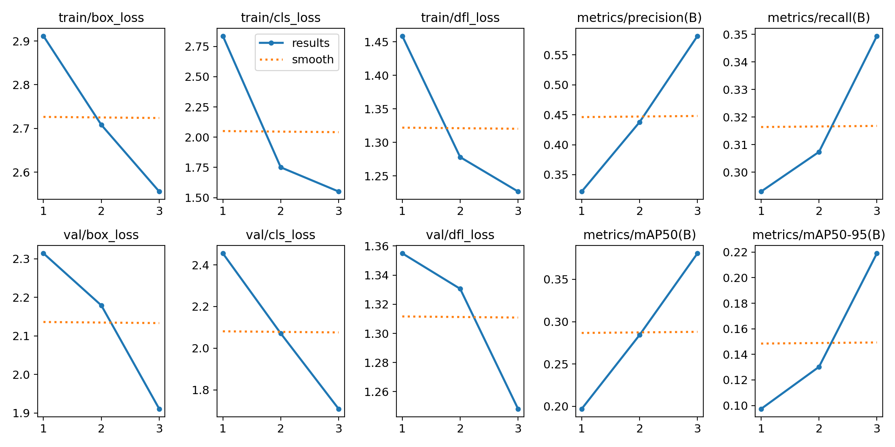
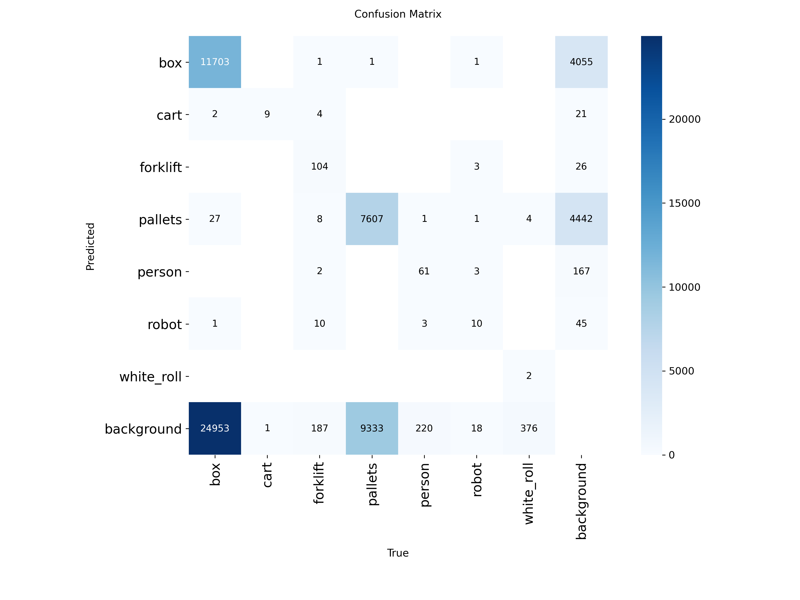

# Warehouse Object Detection using YOLOv8

---

## Project Overview

This project builds an AI computer vision model to detect objects commonly found in warehouse environments such as boxes, pallets, forklifts, robots, and workers.

The model is trained using the YOLOv9 object detection framework and a labeled warehouse dataset.

---

## Technologies Used

* Python
* YOLOv9 (Ultralytics)
* PyTorch
* Computer Vision
* Roboflow Dataset

---

## Quick Start

Clone the repository:

git clone https://github.com/vijaygavvala/warehouse-object-detection-yolo.git

Install dependencies:

pip install -r requirements.txt

Run object detection:

python predict.py

---

## Dataset

The dataset contains labeled warehouse images with objects such as:

* Box
* Cart
* Forklift
* Pallets
* Person
* Robot
* White Roll

Only sample images are included in this repository.

---

## Model Training

Training command used:

yolo task=detect mode=train model=yolov9n.pt data=data.yaml epochs=5 imgsz=320 batch=8

---

## Demo

This project detects warehouse objects such as boxes, pallets, forklifts and workers using a YOLOv9 model trained on labeled warehouse images.

Example detection outputs are shown below.

---

## Model Results

The trained model achieves object detection performance evaluated using:

* Precision
* Recall
* mAP (Mean Average Precision)

---

## Detection Results

Example object detection outputs:

## Confusion Matrix

---

## Project Structure

warehouse-object-detection-yolo
│
├── dataset
│   ├── sample_images
│   └── dataset_info.md
│
├── model
│   └── best.pt
│
├── notebook
│   └── train.py
│
├── results
│   ├── results.png
│   ├── confusion_matrix.png
│   └── predicted_images
│
├── predict.py
├── evaluate.py
├── run_project.py
├── requirements.txt
├── .gitignore
├── LICENSE
└── README.md

---

## Applications

Warehouse Automation
Inventory Monitoring
Robotics Vision Systems
Smart Logistics

---

## Author

**Vijay Gavvala**
B.Tech Data Science Graduate
Hyderabad, India
